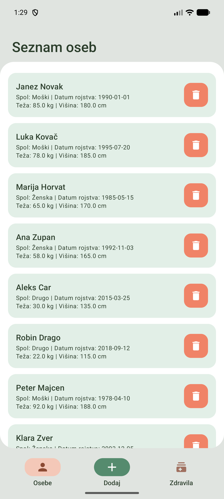
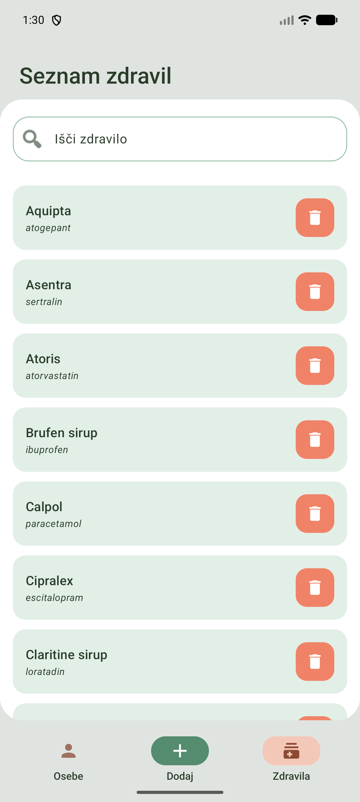
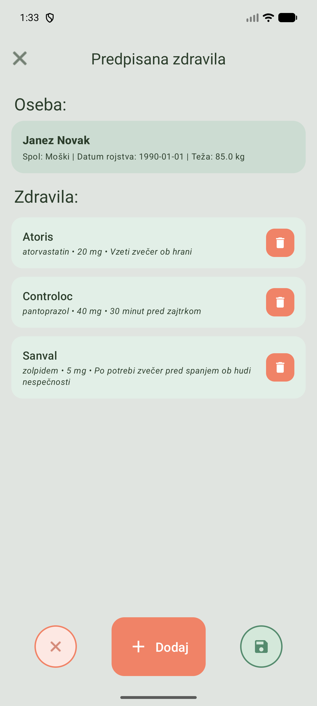
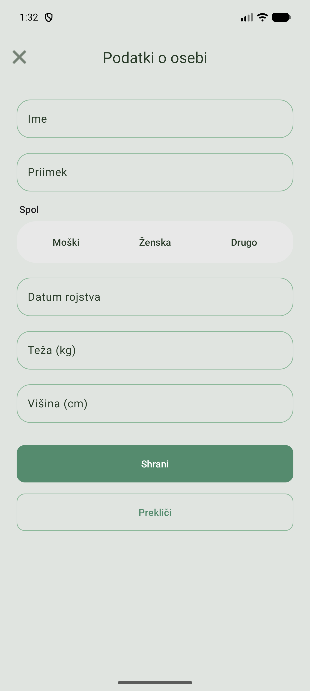
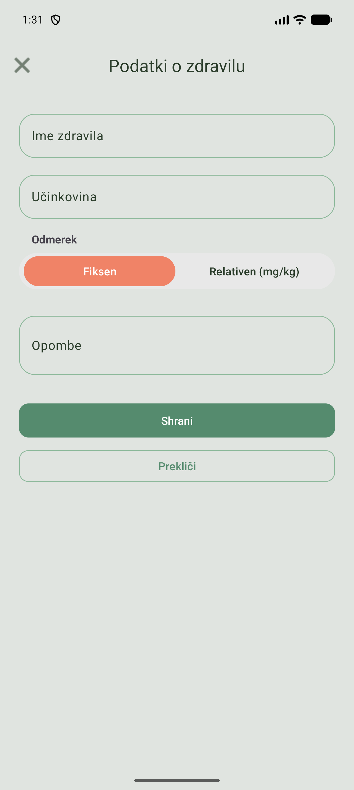
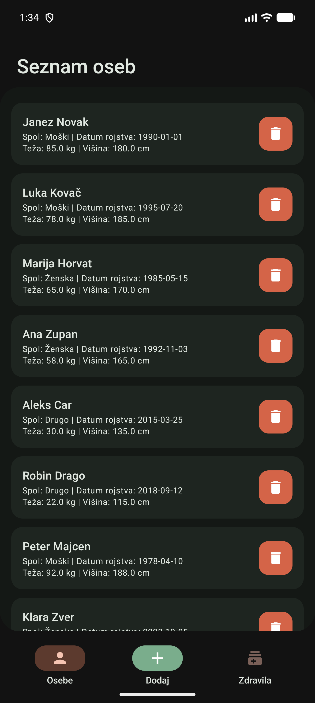
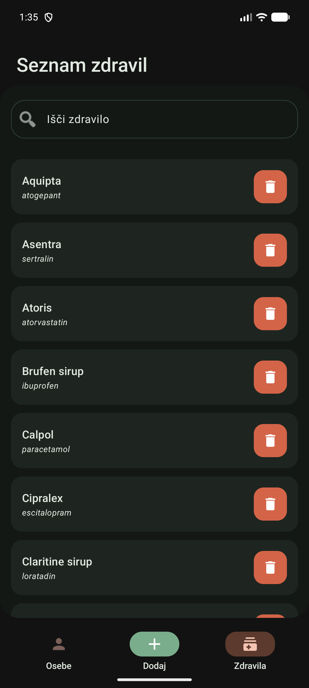
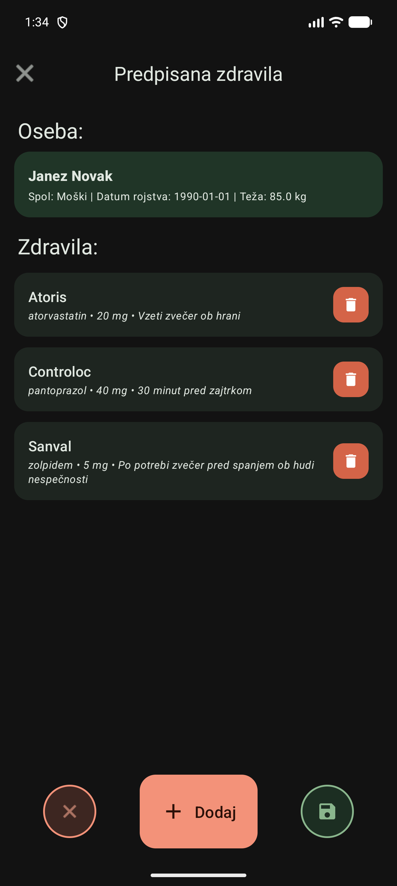

# Naloga 5 — Medical Checkup Assistant

Android app (Kotlin, API 34+) for managing patient data and calculating medicine dosages.

## Features

- **Patient management** — add, edit, and delete patients (name, gender, date of birth, weight, height) via a `RecyclerView` list
- **BMI calculator** — computes Body Mass Index for a selected patient and displays the result
- **Medicine catalog** — add, edit, and delete medicines with dose ranges (mg/kg) and concentration info
- **Dosage calculator** — given a patient's weight and a medicine's dose range + concentration, calculates the recommended dose in both mg and ml

## Screenshots

### Light Mode

| People List | Medicines List | Prescriptions |
| :---: | :---: | :---: |
|  |  |  |

| Add Person | Add Medicine |
| :---: | :---: |
|  |  |

### Dark Mode

| People List | Medicines List | Prescriptions |
| :---: | :---: | :---: |
|  |  |  |

